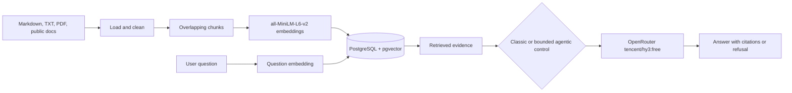

# RAG Documentation Assistant

The application answers questions from a local knowledge base of official Kubernetes documentation. It retrieves relevant passages from PostgreSQL with pgvector, sends only selected evidence to an OpenRouter model, cites the source passages, and refuses when the evidence is not strong enough.

The project is designed to demonstrate the engineering decisions behind a production RAG system: ingestion, chunking, embeddings, persistent vector search, metadata filtering, grounded generation, refusal behavior, agent traces, and comparative evaluation.

## What It Solves

- Answers documentation questions without requiring users to search many pages manually.
- Grounds generated answers in retrieved source passages.
- Shows source filenames, titles, chunk identifiers, positions, and relevance scores.
- Refuses unsupported or ambiguous questions instead of intentionally filling gaps.
- Retries weak retrieval with a bounded query rewrite in Agentic RAG mode.
- Provides a reproducible comparison between no-RAG LLM, classic RAG, and Agentic RAG.

## Current Result

The current live evaluation uses 14 labeled questions and the `tencent/hy3:free` model through OpenRouter:

| System | Behavior accuracy | Best use case |
| --- | ---: | --- |
| No-RAG LLM | 28.6% | General knowledge outside the indexed corpus |
| Classic RAG | 71.4% | Straightforward in-corpus questions with lower latency |
| Agentic RAG | 78.6% | Weak or ambiguous retrieval that benefits from bounded rewriting |

Important findings:

- Agentic RAG recovered a storage question that classic RAG safely refused.
- Classic and Agentic RAG tied on ordinary in-corpus questions.
- Classic RAG was faster because it performs one retrieval pass.
- No-RAG answered general questions outside the corpus, but it provided no project citations and was less safe on unsupported questions.
- These figures are a benchmark snapshot, not a production quality guarantee.

The detailed result is stored in [`data/evaluation_report.json`](data/evaluation_report.json) and presented in the project wiki at [`/showcase`](http://127.0.0.1:8080/showcase).

## Architecture



### Classic RAG

1. Embed the question.
2. Retrieve the top passages from pgvector.
3. Apply evidence and overlap safety checks.
4. Send retrieved context to the LLM.
5. Return the answer and citations, or refuse.

### Agentic RAG

Agentic mode extends classic RAG with a bounded controller in [`agentic_rag/agentic_pipeline.py`](agentic_rag/agentic_pipeline.py):

1. Retrieve evidence.
2. Evaluate whether the evidence is sufficient.
3. Rewrite the query using retrieved document context when the query is weak or ambiguous.
4. Retrieve again, up to three iterations.
5. Generate a grounded answer or return a refusal.

This is intentionally not an unbounded autonomous agent. It does not browse the web, plan arbitrary tools, call external tools, or run a self-reflection loop.

## Technology

- Python 3.12+
- FastAPI and Uvicorn
- PostgreSQL 16+
- pgvector with an HNSW cosine index
- `sentence-transformers/all-MiniLM-L6-v2` for embeddings
- OpenRouter for LLM generation
- `tencent/hy3:free` as the configured generation model
- NumPy, pypdf, Requests, Pydantic, and psycopg 3
- Plain HTML, CSS, and JavaScript for the browser interface

## Prerequisites

Install the following before setup:

- Python 3.12 or newer
- PostgreSQL with the pgvector extension
- An OpenRouter API key

Create the local database and enable pgvector:

```bash
createdb rag_assistant
psql -d rag_assistant -c "CREATE EXTENSION IF NOT EXISTS vector;"
```

The project does not require Docker for local development.

## Installation

```bash
git clone https://github.com/amandeepsingh29/agentic-RAG.git
cd agentic-RAG

python3 -m venv .venv
source .venv/bin/activate
python -m pip install --upgrade pip
pip install -e .
```

Create a `.env` file in the project root. Never commit this file or expose the API key in source control.

```dotenv
OPENROUTER_API_KEY=replace-with-your-key
OPENROUTER_HTTP_REFERER=http://127.0.0.1:8080
OPENROUTER_TITLE=RAG Documentation Assistant
DATABASE_URL=postgresql://127.0.0.1:5432/rag_assistant
```

## Download and Index Documents

Download the current Kubernetes document set:

```bash
rag-docs download-docs --output data/kubernetes
```

Ingest the documents into PostgreSQL and pgvector:

```bash
rag-docs ingest \
  --documents data/kubernetes \
  --index data/pgvector
```

The index stores each chunk with its embedding, source, title, position, and JSON metadata. The `--index` path is retained for CLI compatibility; the actual persistent vector store is PostgreSQL and is selected through `DATABASE_URL`.

## Ask Questions from the CLI

Agentic mode is the default:

```bash
rag-docs ask "How do Deployments manage ReplicaSets and Pods?"
```

Run the classic baseline explicitly:

```bash
rag-docs ask "How do Deployments manage ReplicaSets and Pods?" --mode classic
```

The result includes:

- Generated answer
- Abstention status
- Refusal reason when applicable
- Source passages and relevance scores
- Agent trace in Agentic RAG mode

## Run the Web App

```bash
uvicorn agentic_rag.api:app --host 127.0.0.1 --port 8080 --reload
```

Open:

- Chat interface: [http://127.0.0.1:8080/](http://127.0.0.1:8080/)
- Project wiki and evaluation: [http://127.0.0.1:8080/showcase](http://127.0.0.1:8080/showcase)
- Health check: [http://127.0.0.1:8080/health](http://127.0.0.1:8080/health)

The chat interface supports:

- User questions and suggestion cards
- Thinking/search state while the request is running
- Source evidence cards
- Agent retrieval traces
- Timeout and API error states
- New-chat reset
- Responsive desktop and mobile layouts

## API Endpoints

### `GET /health`

Returns the service status.

### `POST /ask`

Ask a question with optional metadata filters:

```json
{
  "question": "How do ConfigMaps help with configuration?",
  "filters": {
    "extension": "md"
  }
}
```

### `POST /refresh-docs`

Downloads the configured public Kubernetes documentation corpus into the allowed data directory.

### `POST /ingest`

Loads and indexes documents from a project data path.

## Evaluation

The evaluation dataset is [`data/eval_queries.jsonl`](data/eval_queries.jsonl). It includes:

- In-corpus documentation questions
- A weak-retrieval question designed to test agentic recovery
- General questions outside the indexed corpus
- Unsupported questions
- Ambiguous questions

Run the full three-way live evaluation:

```bash
rag-docs compare \
  --documents data/kubernetes \
  --questions data/eval_queries.jsonl \
  --index data/pgvector \
  --output data/evaluation_report.json
```

The comparison runs all answers through the live OpenRouter model:

- **No-RAG LLM:** receives the question without retrieved context.
- **Classic RAG:** retrieves once and generates from the selected context.
- **Agentic RAG:** performs bounded evidence evaluation and query rewriting.

The report records:

- Overall behavior accuracy
- Category-level accuracy
- Answer rate
- Citation rate on generated answers
- Average latency
- Number of LLM calls
- Refusals
- Per-question outputs and traces
- Winning systems by category

The benchmark uses labeled expected behavior, expected answer keywords, refusal checks, and citation checks. It is transparent and reproducible, but it is not a substitute for a larger human-reviewed or independent-judge evaluation set.

## Testing

Run the automated test suite:

```bash
pytest -q
```

The tests cover:

- Document download and ingestion
- Vector retrieval
- Grounded answer generation with a test double
- Refusal for unrelated questions
- Ambiguous query handling
- Bounded Agentic RAG traces
- Metadata-filtered retrieval
- Evaluation dataset coverage

The automated tests do not spend API credits. The live OpenRouter comparison is run separately with `rag-docs compare`.

## Project Layout

```text
agentic_rag/
  agentic_pipeline.py   Bounded agentic controller
  api.py                 FastAPI application and routes
  chunking.py            Chunk construction
  embeddings.py          Sentence-transformer embeddings
  evaluation.py         Three-way live evaluation
  ingestion.py           Document loading and Kubernetes download
  llm.py                 OpenRouter client
  pipeline.py            Classic RAG pipeline
  vector_store.py        PostgreSQL + pgvector store

data/
  kubernetes/            Local Kubernetes Markdown corpus
  eval_queries.jsonl     Labeled evaluation questions
  evaluation_report.json Latest comparison output

webapp/
  index.html             User-facing chat interface
  showcase.html          Static project wiki

tests/
  test_pipeline.py       Automated pipeline tests
```

## Safety and Production Gaps

This repository is production-shaped, but it is not ready to ingest private company data without additional controls.

Before adding Slack, Notion, Google Drive, Confluence, email, or other private sources, implement:

- Per-user and per-group access-control metadata on every chunk
- Permission-aware filtering before context reaches the LLM
- Incremental sync using source IDs, timestamps, and content hashes
- Deletion handling when a source page or message is removed
- Connector-specific OAuth and token rotation
- Audit logging for retrieval and generated answers
- Rate limiting, retries, and provider failure handling
- Larger human-reviewed evaluation sets
- Independent groundedness and citation-quality evaluation
- PII and secret detection before indexing

The current corpus is public Kubernetes documentation. Do not place private documents or API keys in the repository.

## License and Source Data

The application code is contained in this repository. The Kubernetes documents are downloaded from the public Kubernetes documentation repository for evaluation and demonstration. Review the source project’s licensing and usage requirements before redistributing or using the corpus commercially.
